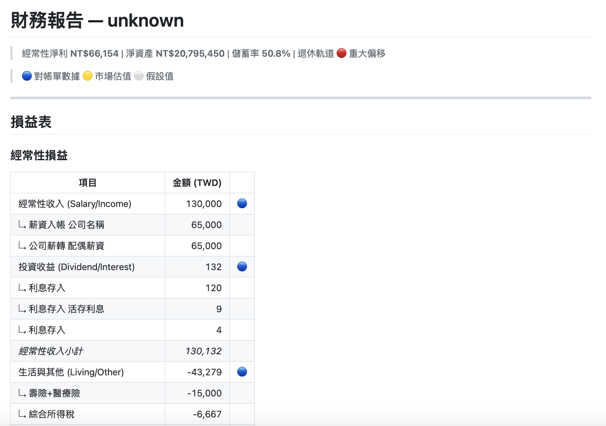
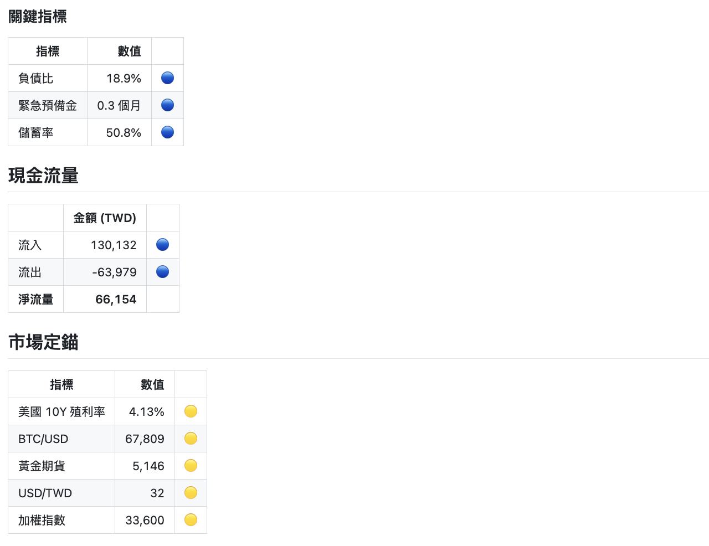
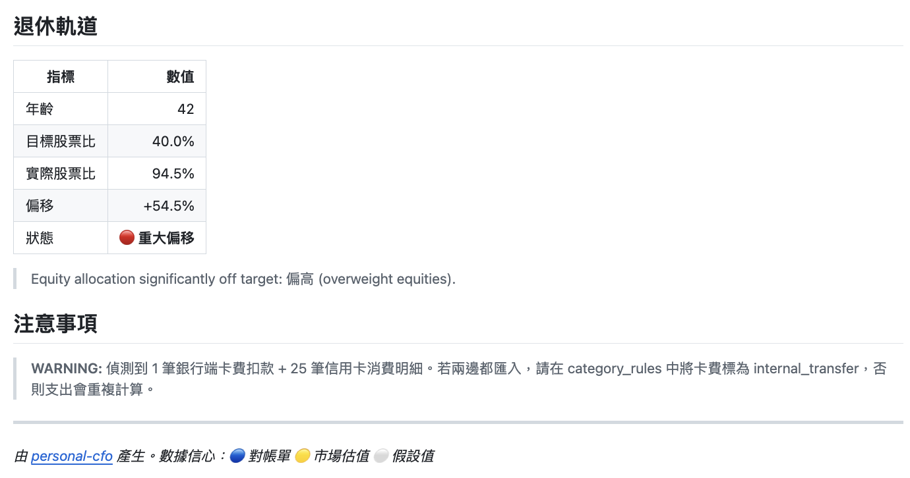

# personal-cfo

> [繁體中文 README](README.md)

**Reference implementation** — how a non-professional investor can monitor their retirement glide path with deterministic computation.

Bank statements in, financial reports out, your data stays local. Fork it and adapt `config.yaml` to your situation.

**Requires Python 3.9+** · Part of the notoriouslab open-source toolkit.

Any AI agent framework can call it via shell. Includes `SKILL.md` for direct [OpenClaw](https://openclaw.ai/) integration.

## What This Is NOT

- Not a trading tool — it won't tell you to buy or sell
- Not a SaaS — no database, no account needed
- Not plug-and-play — you need CLI skills and must configure your own classification rules

## What This IS

A **framework and template** for monthly financial checkups. It demonstrates a methodology:

| Feature | Description |
|---------|-------------|
| Post-hoc audit | Uses last month's bank statements, 100% objective, no forecasting |
| Deterministic computation | Python calculates the numbers, zero hallucination, no AI guessing |
| Retirement glide path | Automatically reduces equity target with age, alerts only on drift |
| Anti-noise | Stays silent when on track, doesn't manufacture anxiety |
| Multi-format input | CSV, doc-cleaner Markdown+JSON, hand-written pipe tables |
| Multi-currency | Static FX rates via config, supports USD/JPY/CNY/AUD etc. |
| Atomic writes | tempfile + `os.replace()`, no half-written output |
| Offline mode | `--offline` skips network, uses cached/hardcoded market data |

Everyone's financial situation is different. This tool gives you a starting point and a thinking framework — you can (and should) modify the classification rules, asset allocation, and retirement parameters to fit your own needs.

## What It Produces

- **Income Statement** (8-category P&L)
- **Balance Sheet** (assets vs liabilities by risk bucket)
- **Cash Flow Summary** (operating inflow/outflow)
- **Market Anchors** (global indicators for context)
- **Retirement Glide Path Diagnosis** (are you on track?)

See `examples/sample_output/` for a complete report example:







## Pipeline

Part of the lazy finance trilogy (each works independently):

```
gmail-statement-fetcher  →  doc-cleaner  →  personal-cfo
(fetch bank PDFs)           (PDF→Markdown)   (compute reports)
```

| Ring | Input | Output | Standalone |
|------|-------|--------|------------|
| [gmail-statement-fetcher](https://github.com/notoriouslab/gmail-statement-fetcher) | Gmail | PDF | Yes |
| [doc-cleaner](https://github.com/notoriouslab/doc-cleaner) | PDF/DOCX/XLSX | Markdown + JSON | Yes |
| **personal-cfo** | CSV or Markdown+JSON | Financial reports + snapshots | Yes |

## Quick Start

```bash
git clone https://github.com/notoriouslab/personal-cfo.git
cd personal-cfo

# Install core dependency (pyyaml only)
pip install -r requirements.txt

# Optional: live market data
pip install -r requirements-full.txt

# Copy and edit config
cp config.example.yaml config.yaml

# Try with sample data
python -m personal_cfo cfo \
  --transactions ./examples/sample_transactions.csv \
  --assets ./examples/sample_assets.csv \
  --period 2026-01 --offline

# Monthly audit (doc-cleaner Markdown output)
python -m personal_cfo cfo \
  --transactions ./statements/ \
  --period 2026-01 \
  --offline

# Monthly audit (plain Markdown with pipe tables)
python -m personal_cfo cfo \
  --transactions ./my_statement.md \
  --period 2026-01 --offline

# Retirement track check (from saved snapshots)
python -m personal_cfo track --snapshots ./output/snapshots/
```

## Input Formats

### CSV (universal)
```csv
date,description,amount,currency,category,account
2026-01-05,Salary,150000,TWD,salary,Bank_A
2026-01-10,Mortgage,-25000,TWD,housing,Bank_B
```

### Markdown + JSON (from doc-cleaner pipeline)
Reads `STRUCTURED_DATA` JSON blocks embedded in Markdown files. Credit card files (filename contains `credit`) are automatically sign-flipped.

**Cross-reference mode:** Even when JSON has `transactions[]`, the parser cross-checks against pipe tables in `refined_markdown` to supplement missing transactions and enrich descriptions from remarks columns.

### Plain Markdown (hand-written or from any source)
Any `.md` file with pipe tables will work — no special format required. The parser detects transaction tables by column headers (date, description, amount). See `examples/sample_statement.md`.

## Configuration

See `config.example.yaml` for all options:

| Section | Purpose |
|---------|---------|
| `life_plan` | Birth year, retirement age |
| `glide_path` | Equity target, annual derisking rate, drift thresholds |
| `manual_assets` | Assets not in bank statements (real estate, etc.) |
| `category_rules` | Keyword → category mapping (**order matters**, specific first) |
| `annual_expenses` | Annual expenses (insurance, tax), auto-prorated to monthly |
| `fx_rates` | Static exchange rates (format: `USD_TWD: 32.0`) |

## CLI Options

```
python -m personal_cfo cfo --help
python -m personal_cfo track --help
```

| Option | Description |
|--------|-------------|
| `--transactions`, `-t` | Transaction CSV files, Markdown files, or directory |
| `--assets`, `-a` | Assets CSV file (optional) |
| `--period`, `-p` | Period label (e.g. `2026-01`) |
| `--config`, `-c` | Config file path (default: `config.yaml`) |
| `--output`, `-o` | Output directory |
| `--offline` | Skip network calls (use cached/hardcoded market data) |
| `--quiet`, `-q` | Only save files, no stdout |

## Usage Scenarios

The `examples/` directory includes config templates for different life stages and complete sample statements:

**Config templates:**

| Template | Scenario | Focus |
|----------|----------|-------|
| `config_young_professional.yaml` | 30-year-old single professional | High equity, wide tolerance, simple rules |
| `config_mid_career_family.yaml` | 42-year-old dual-income family | Mortgage, insurance, education expenses |
| `config_pre_retirement.yaml` | 56-year-old pre-retirement | Defensive allocation, detailed rules, multi-currency |

**Sample statements (fictional middle-class family):**

| File | Type | Contents |
|------|------|----------|
| `sample_bank_statement.md` | Bank statement | Payroll, mortgage, deposits, FX |
| `sample_credit_card.md` | Credit card bill | Daily spending, supplementary cards, cashback |
| `sample_securities.md` | Brokerage statement | ETF/stock holdings, trade details |
| `sample_output/` | Generated report | Full analysis of the above three statements |

These are not "best configs" — they help you understand why each parameter exists, so you can write your own.

## Security

- No cloud required: all computation runs locally, no data uploaded
- Atomic writes: tempfile + `os.replace()`, no half-written output
- Secret isolation: `config.yaml` is in `.gitignore`, never committed
- Market data degradation: yfinance → cache → hardcoded fallback (with warning)

## AI Agent Integration

```bash
python -m personal_cfo cfo \
  --transactions ./statements/ \
  --period 2026-02 \
  --offline --quiet
```

Includes `SKILL.md` for [OpenClaw](https://openclaw.ai/) or other AI agent frameworks.

## Contributing

See [CONTRIBUTING.md](CONTRIBUTING.md).

## License

MIT
